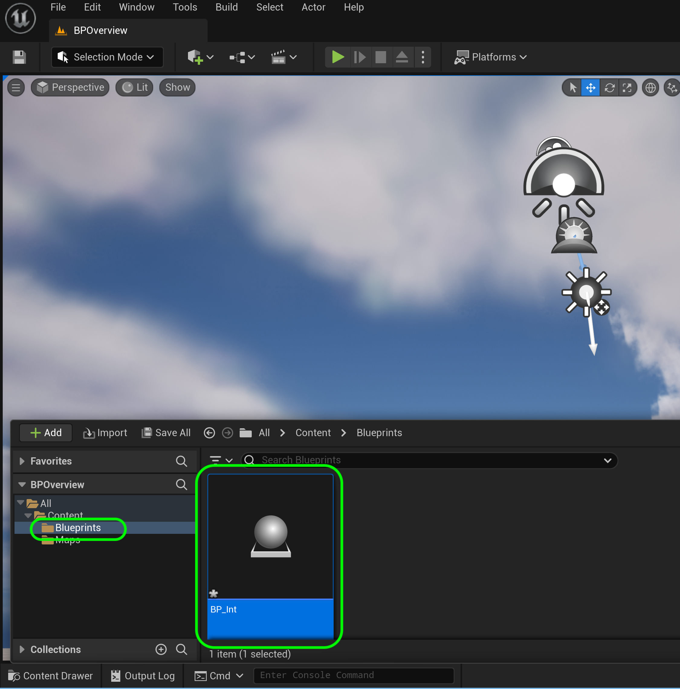
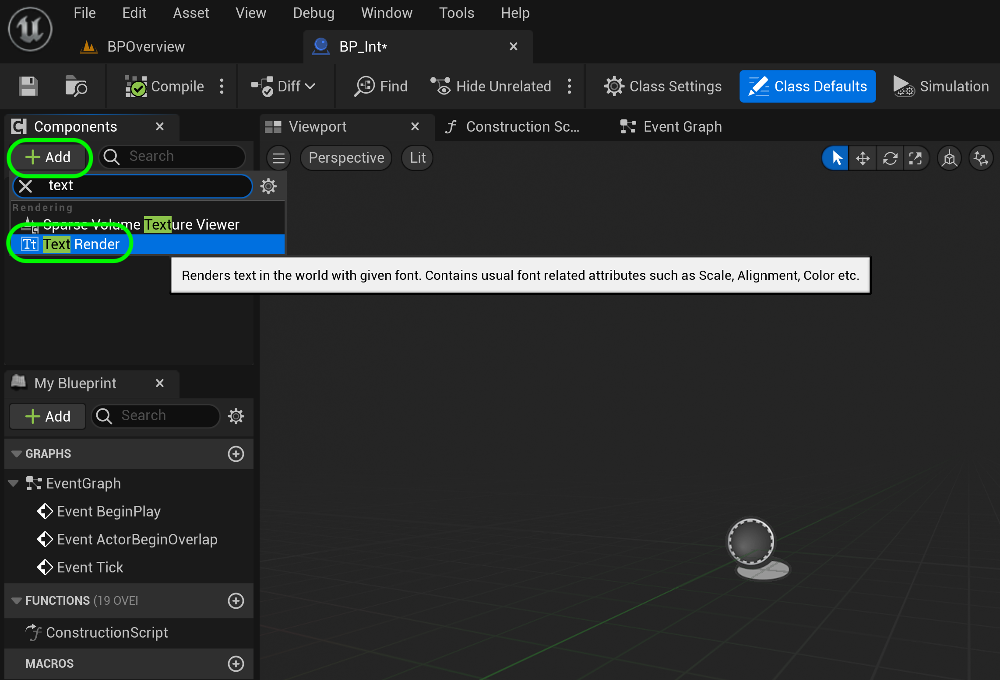
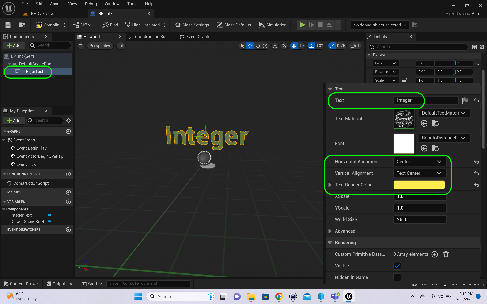

### Blueprint Data Types

[previous](../setting-up/README.md#user-content-setting-up-unreal) • [home](../README.md#user-content-ue5-bp-overview) • [next](../)

Unreal Blueprints is a visual scripting system in the Unreal Engine, a popular game development platform. It allows you to create gameplay mechanics, interactions, and logic using a node-based interface, without having to write traditional code. They all have a **C++** parent origin in the engine.

Imagine Blueprints as a graph where you connect different nodes together to create functionality in your game. Each node represents a specific action or condition, and you connect them by drawing lines between them. By combining these blocks, you can create complex behaviors and interactions for your game characters, objects, and environments.

The connections between nodes represent the flow of execution, determining the order in which actions are performed. When the game runs, the nodes are executed in sequence, and the actions they represent are carried out. This allows you to create interactive and dynamic gameplay experiences without writing code from scratch. The white triangles at the begining and end of a node are the execution nodes. They also have colored pins which is for the flow of data.

Blueprints is designed to be accessible to both programmers and non-programmers, allowing artists, designers, and other game developers to create gameplay systems without needing extensive coding knowledge. It provides a visual and intuitive way to prototype, iterate, and implement game mechanics.

C++ using **Unreal's Library** can compile and be used a blueprints. The relationship between Blueprints and C++ in Unreal Engine is complementary. Blueprints provide a visual and higher-level approach to implementing gameplay mechanics and interactions, while C++ offers greater control, flexibility, and performance optimizations. You can use both in combination, depending on your needs and the complexity of your project. Blueprint scripts can be extended and enhanced with custom C++ code when necessary to achieve specific functionality or improve performance.

Lets look at the complementary data types in UE5.
 

---

##### `Step 1.`\|`BPOVR`|:small_blue_diamond:

Let's add a **Blueprint** to the game that will hold some text.  Select the **Blueprints** folder and *right click* in the open area and select **Blueprint Class**. Then with the next popup, select **Actor** (we will be getting into classes later).  This is the minimum class needed to be a game object in the world.  This comes with lots of functionality that we will explore as we go along.  The most important thing is that it allows us to attach geometry, text and apply physics to that object.

>An Actor is any object that can be placed into a level, such as a Camera, static mesh, or player start location. Actors support 3D transformations such as translation, rotation, and scaling. - Unreal Manual

##### `Step 2.`\|`BPOVR`|:small_blue_diamond: :small_blue_diamond: 

Name that Blueprint `BP_Int`.  We are using [Unreal's Recommended Naming Convention](https://docs.unrealengine.com/4.27/en-US/ProductionPipelines/AssetNaming/) for our projects.  They recommends that we preface blueprint names with `BP_`.

##### `Step 3.`\|`BPOVR`|:small_blue_diamond: :small_blue_diamond: :small_blue_diamond:

Open up **BP_Int**.  Press the <kbd>Add</kbd> button and add a **Text Render** component.

##### `Step 4.`\|`BPOVR`|:small_blue_diamond: :small_blue_diamond: :small_blue_diamond: :small_blue_diamond:

##### `Step 5.`\|`BPOVR`| :small_orange_diamond:

##### `Step 6.`\|`BPOVR`| :small_orange_diamond: :small_blue_diamond:

##### `Step 7.`\|`BPOVR`| :small_orange_diamond: :small_blue_diamond: :small_blue_diamond:

##### `Step 8.`\|`BPOVR`| :small_orange_diamond: :small_blue_diamond: :small_blue_diamond: :small_blue_diamond:

##### `Step 9.`\|`BPOVR`| :small_orange_diamond: :small_blue_diamond: :small_blue_diamond: :small_blue_diamond: :small_blue_diamond:

##### `Step 10.`\|`BPOVR`| :large_blue_diamond:

##### `Step 11.`\|`BPOVR`| :large_blue_diamond: :small_blue_diamond: 

##### `Step 12.`\|`BPOVR`| :large_blue_diamond: :small_blue_diamond: :small_blue_diamond: 

##### `Step 13.`\|`BPOVR`| :large_blue_diamond: :small_blue_diamond: :small_blue_diamond:  :small_blue_diamond: 

##### `Step 14.`\|`BPOVR`| :large_blue_diamond: :small_blue_diamond: :small_blue_diamond: :small_blue_diamond:  :small_blue_diamond: 

##### `Step 15.`\|`BPOVR`| :large_blue_diamond: :small_orange_diamond: 

##### `Step 16.`\|`BPOVR`| :large_blue_diamond: :small_orange_diamond:   :small_blue_diamond: 

##### `Step 17.`\|`BPOVR`| :large_blue_diamond: :small_orange_diamond: :small_blue_diamond: :small_blue_diamond:

##### `Step 18.`\|`BPOVR`| :large_blue_diamond: :small_orange_diamond: :small_blue_diamond: :small_blue_diamond: :small_blue_diamond:

##### `Step 19.`\|`BPOVR`| :large_blue_diamond: :small_orange_diamond: :small_blue_diamond: :small_blue_diamond: :small_blue_diamond: :small_blue_diamond:

##### `Step 20.`\|`BPOVR`| :large_blue_diamond: :large_blue_diamond:

##### `Step 21.`\|`BPOVR`| :large_blue_diamond: :large_blue_diamond: :small_blue_diamond:

<!--  -->

| [previous](../setting-up/README.md#user-content-setting-up-unreal)| [home](../README.md#user-content-ue5-bp-overview) | [next](../)|
|---|---|---|
