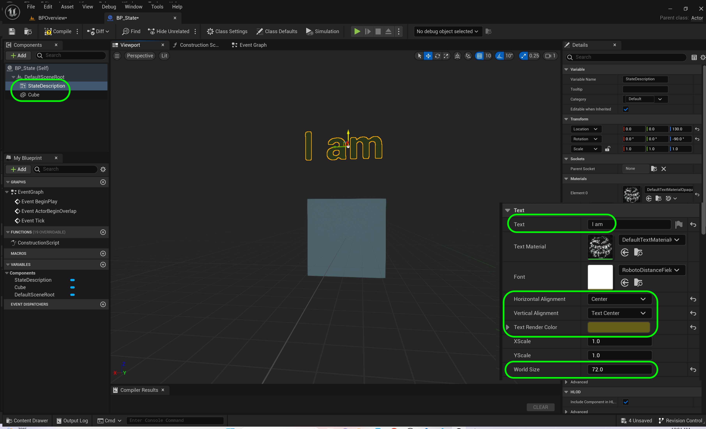
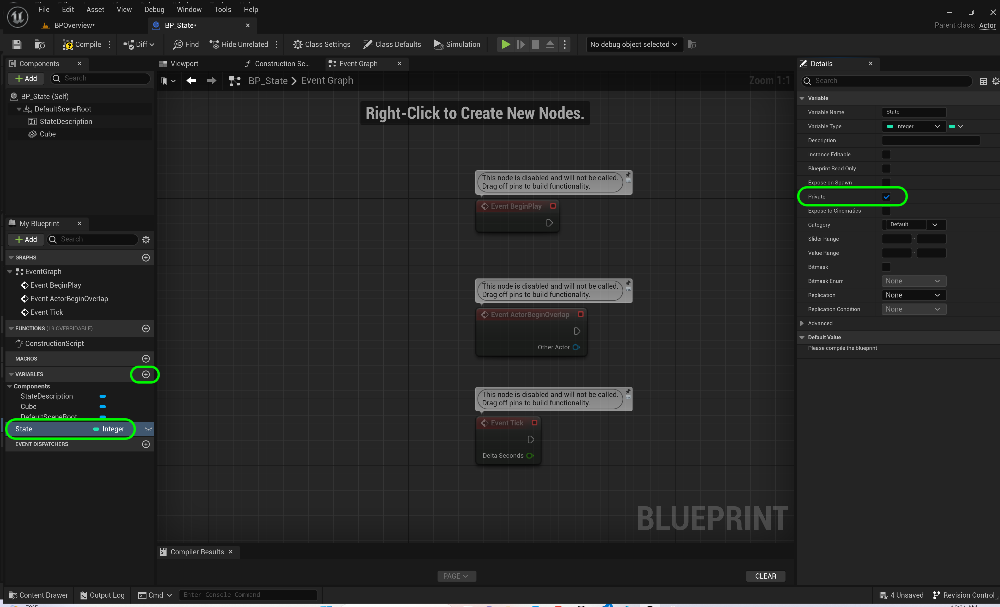
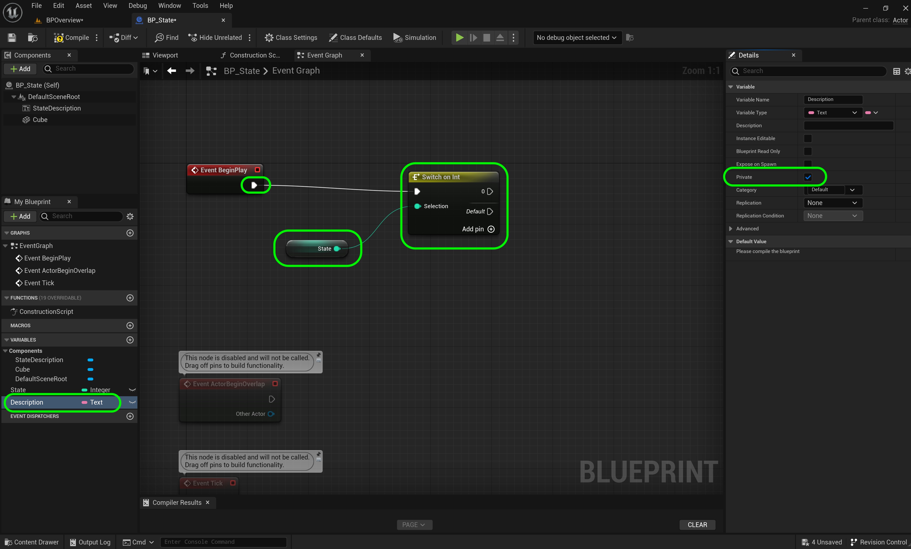
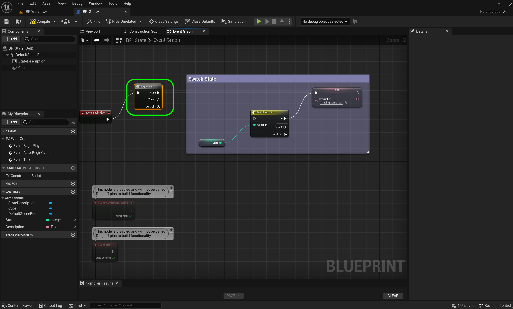
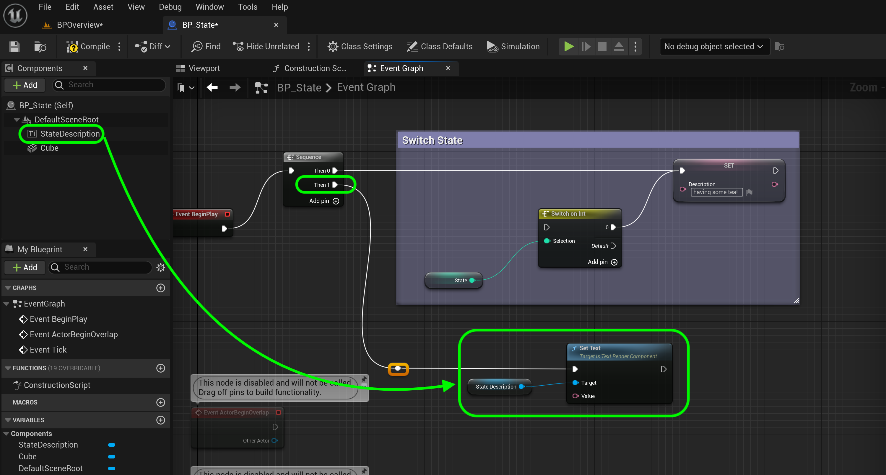
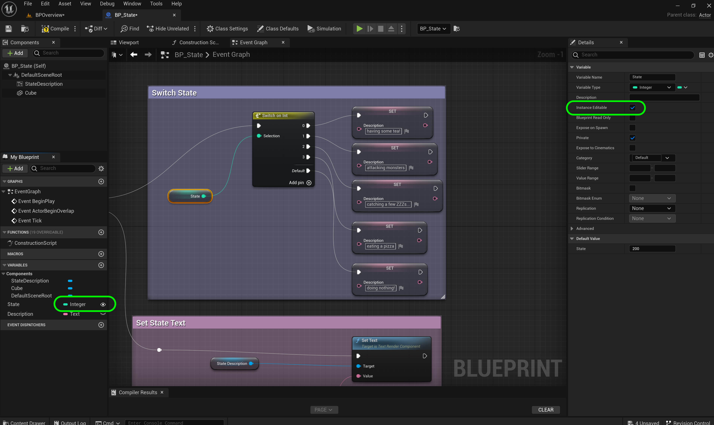
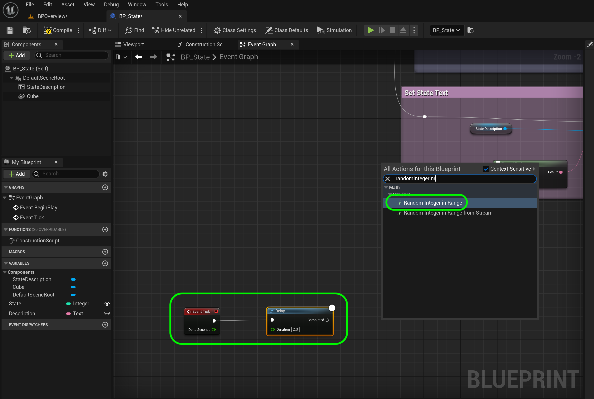
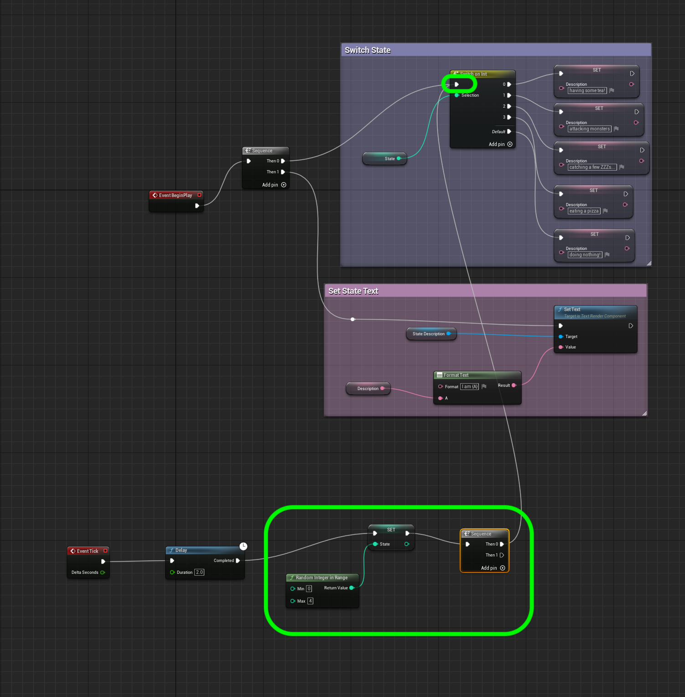

### Blueprint Iteration

<sub>[previous](../operators-ii/README.md#user-content-blueprint-operators-ii) • [home](../README.md#user-content-ue5-bp-overview) • [next](../iteration-ii/README.md#user-content-blueprint-iteration-ii)</sub>


Lets add a stat to a game object and use a switch statement to change messages. Now iterating loops in Blueprints can be a bit unwieldly.  This is one area where I think **C++** is a bit easier to read and elegant than the amount of pins often needed in an iteration in a blueprint.

<br>

---

##### `Step 1.`\|`BPOVR`|:small_blue_diamond:

Select the **Blueprints** folder and right click in the open area and selet **Blueprint Class** and press the <kbd>Actor</kbd> button.  Name this new Blueprint `BP_State`.


##### `Step 2.`\|`BPOVR`|:small_blue_diamond: :small_blue_diamond: 

For visual interest add a **Cube** component.  This will simulate an actor with a thought bubble above their head.  Add a **TextRender** component and call it `State Description`.  Change the **Text** to `I am `, the **Horizontal Alignment** and **Vertical Alignment** to `Center` and `TextCenter` and the **Text Render Color** to the same color we have been using.  Finally change the **World Size** to `72`.  Adjust the height of the text so it is above the cube.




##### `Step 3.`\|`BPOVR`|:small_blue_diamond: :small_blue_diamond: :small_blue_diamond:

Create a new **Integer** variable called `State`. Now, I think it is important to mark variables as **Private** (can only be read by this blueprint - not any other including child blueprints).  Only leave it public, when you are certain that you need to access tis variable from outside this blueprint.  It is a good way to protect yourself for unpredictable behavior in the game.




##### `Step 4.`\|`BPOVR`|:small_blue_diamond: :small_blue_diamond: :small_blue_diamond: :small_blue_diamond:

Drag the **State** variabel to the graph.  Click off the pin and select a **Switch on Int** node.


##### `Step 5.`\|`BPOVR`| :small_orange_diamond:

Connect the execution pin from **Event BeginPlay** to **Switch on Int**. Add a new **Text** variable called `Description` and make sure **Private** is `true`.




##### `Step 6.`\|`BPOVR`| :small_orange_diamond: :small_blue_diamond:

Drag a **Set Description** node and add `having some tea!` to the text box.  Connect the **Switch | 0** execution pin. 


##### `Step 7.`\|`BPOVR`| :small_orange_diamond: :small_blue_diamond: :small_blue_diamond:

We do nto want to deal with the execution pins coming from the **Switch Statement**.  Otherwise to go to one location from say 10 switch conditions, we would have to wire all 10 execution pins to that node.  There is a cleaner way of handling a more complicated graph flow.  Lets add a **Sequence** node to the graph and put it between **Begin Play** and the **Switch on Int** nodes using the **Then 0** pin.

>The Sequence node allows for a single execution pulse to trigger a series of events in order. The node may have any number of outputs, all of which get called as soon as the Sequence node receives an input. They will always get called in order, but without any delay. To a typical user, the outputs will likely appear to have been triggered simultaneously.




##### `Step 8.`\|`BPOVR`| :small_orange_diamond: :small_blue_diamond: :small_blue_diamond: :small_blue_diamond:

Drag a reference to the **State Description** component to the graph and pull off the pin and select **Set Text**.  Connect the data pins and the execution pin to the **Sequence | Then 1**.  S0 the first sequence pin will run all the conditions for the switch statements that are valid, then the `1` pin will run after that is complete.  This stops us from having to deal with the execution branch after each condition which would be messy.




##### `Step 9.`\|`BPOVR`| :small_orange_diamond: :small_blue_diamond: :small_blue_diamond: :small_blue_diamond: :small_blue_diamond:

Press the <kbd>Play</kbd> button and you will see the first state appear.


##### `Step 10.`\|`BPOVR`| :large_blue_diamond:

Make sure the execution pin is correct before the next step that the **Sequence | Then 0** pin goes to the **Switch on Int** (and not the set text).

Press the **Add Pin** 4 times to add cases 1 through 3.  Then create 4 more **Set Description** nodes.  Add the text:

case 1:
```
attacking monsters
```

case 2:
```
catching a few ZZZs
```

case 3:
```
eating a pizza
```

Default:
```
doing nothing!
```

Connect the execution pins to the correct switch numbers.


##### `Step 11.`\|`BPOVR`| :large_blue_diamond: :small_blue_diamond: 

Change the **State** default value to `200`.  Press the <kbd>Play</kbd> button you will notice that any integer that is not `0` through `3` will run the **Default** state which is the message `I am doing nothing!`.


##### `Step 12.`\|`BPOVR`| :large_blue_diamond: :small_blue_diamond: :small_blue_diamond: 

Now right now we can only set the state variable inside the blueprint.  So this means every blueprint we drag into the scene will have the exact same state.  What if we wanted each one to have a different state?  There is a way to expose the variable to each instance so we can edit it in the main deitor.  Click on the **State** variable and set **Instance Editable** to `true` (notice an eyeball will turn on next to the variable on the left side of the blueprint).




##### `Step 13.`\|`BPOVR`| :large_blue_diamond: :small_blue_diamond: :small_blue_diamond:  :small_blue_diamond: 

Now once you press the **Compile** button you can go back to the editor and change the instance in the **Details** panel and if you had multiple instances, could each have their own default value! Check that all your switch statements work properly.


##### `Step 14.`\|`BPOVR`| :large_blue_diamond: :small_blue_diamond: :small_blue_diamond: :small_blue_diamond:  :small_blue_diamond: 

Now lets update the state automatically.  Go back to **BP_State** and add an **Event Tick** and **Delay** node.  Connect their execution pins and set the delay **Duration** to `2.0` seconds.  This means that the execution pin *after* the delay node will only run 2 seconds after the input execution pin is triggered. Add a **Random Integer in Range** node. 




##### `Step 15.`\|`BPOVR`| :large_blue_diamond: :small_orange_diamond: 

Set the **Random Integer in Range | Min** to `0` and **Random Range | Max** to `4` (this gives a 1 in 5 chance for any state to be called including default). Connect the output of the random number node to a new **Sequence** node.  Send the **Then 0** pin to the **Switch on Int** to assign the correct state description. 




##### `Step 16.`\|`BPOVR`| :large_blue_diamond: :small_orange_diamond:   :small_blue_diamond: 

Connect the **Sequence | Then 1** to the **Set Text** node to update the new text after the switch statement is run.


##### `Step 17.`\|`BPOVR`| :large_blue_diamond: :small_orange_diamond: :small_blue_diamond: :small_blue_diamond:

Clean up the graph so no lines cross over nodes and add a comment around the nodes attached to the **Event Tick** node chain and name the comment `Randomize States Periodically`.  


Press the <kbd>Play</kbd> button and every two seconds the state randomly changes.

https://github.com/maubanel/UE5-BP-Overview/assets/5504953/d96c3b09-d3ea-415b-866c-8bf431b0d2e6


<!--  -->


| [previous](../operators-ii/README.md#user-content-blueprint-operators-ii)| [home](../README.md#user-content-ue5-bp-overview) | [next](../iteration-ii/README.md#user-content-blueprint-iteration-ii)|
|---|---|---|
