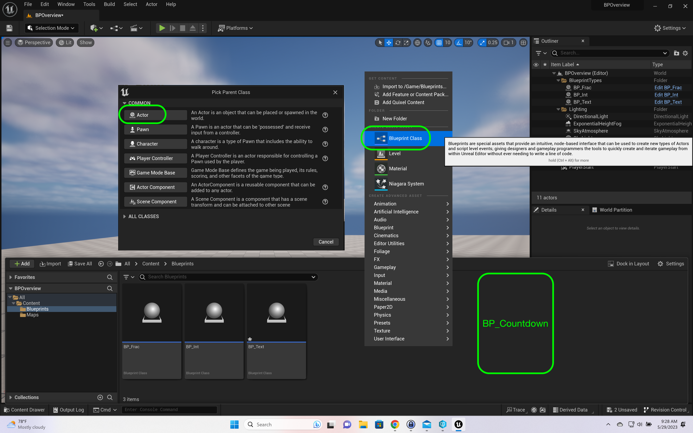
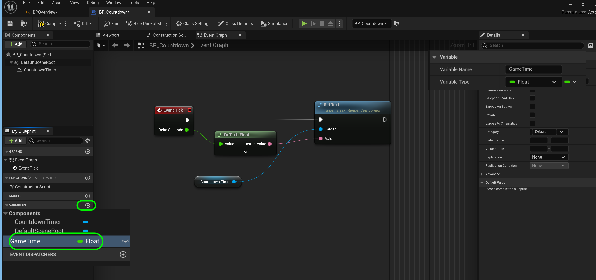
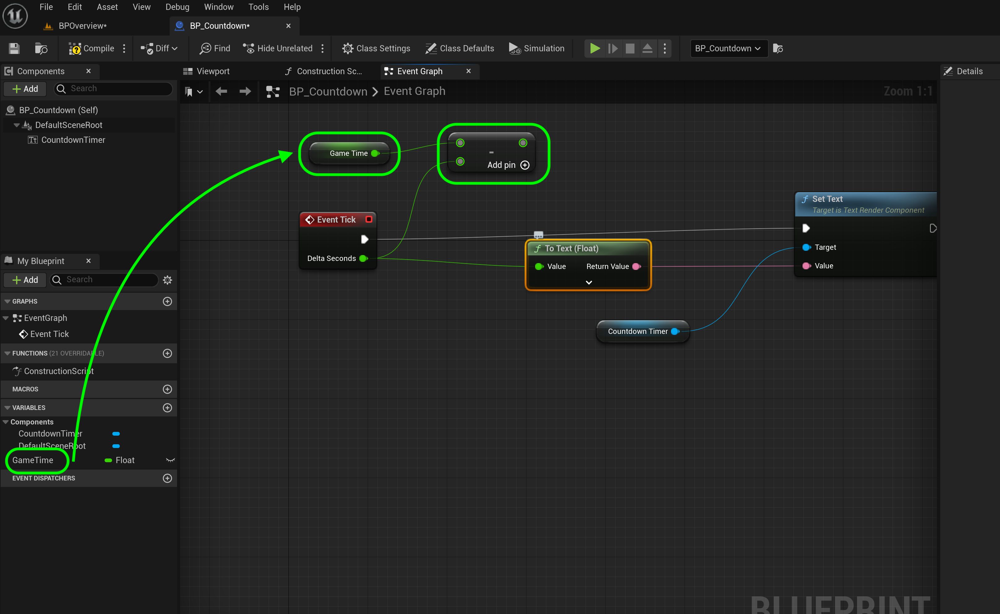

### Blueprint Operators

[previous](../text/README.md#user-content-names-strings-text) • [home](../README.md#user-content-ue5-bp-overview) • [next](../)

Lets create a countdown timer and see how we use operators which is a bit different in Blueprints compared to doing it in C++.

 

---

##### `Step 1.`\|`BPOVR`|:small_blue_diamond:

Select the **Blueprints** folder and right-click in the open folder and select an **Blueprint Class** and select **Actor**.  Call the new blueprint `BP_Countdown`.

##### `Step 2.`\|`BPOVR`|:small_blue_diamond: :small_blue_diamond: 

Open up **BP_Countdown** and add a **Text Render** component.  Chnage the name to `CountdownTimer`.  Copy and paste the **Text Render Color** so it is the same as the others. Change the **Horizontal Alignment** and **Vertical Alignment** to `Center` and `TextCenter`. Change the **Text** to `Countdown Timer` and the **World Size** to `72`.

##### `Step 3.`\|`BPOVR`|:small_blue_diamond: :small_blue_diamond: :small_blue_diamond:

This time we will not use the **Begin Play** but instead use the **Tick Event**.  In Unreal Engine, a **Tick Event** refers to a specific type of event that occurs every frame or at a regular interval. It is commonly used to update and control the behavior of objects or actors within the game world.

Think of the game world as a continuous flow of time, divided into small increments called frames. Each frame represents a snapshot of the game's current state, including the positions and properties of all objects. 

During each frame, the engine goes through various processes, such as rendering graphics and handling player input. In addition, it triggers tick events for objects that have been set up to receive them.

When an object receives a tick event, it means that the engine is giving it an opportunity to perform some actions or calculations. For example, an enemy character might use the tick event to update its position, check for collisions with other objects, or react to player input.

The tick event is called repeatedly, typically 30 or 60 times per second, depending on the frame rate of the game. This regular repetition ensures that objects can constantly update and respond to changes in the game world, providing smooth and interactive gameplay.

By utilizing the tick event, game developers can create dynamic and responsive behaviors for objects in Unreal Engine, making the game world come alive with movement and interactivity.

Drag the **Countdown Timer** to the graph and drag off the pin and add a **Set Text** node.  Now we will take the **Delta Seconds** pin and send it to the **Set Text | Value** pin.

##### `Step 4.`\|`BPOVR`|:small_blue_diamond: :small_blue_diamond: :small_blue_diamond: :small_blue_diamond:

Drag a copy of **BP_Countdown** into the scene.  In the **Outliner** create a folder called `Blueprint Types` and move all the blueprints into the folder to clean up the outliner.

##### `Step 5.`\|`BPOVR`| :small_orange_diamond:

Press the <kbd>Play</kbd> button and you see that it gives you the amount of time that past since last tick in milliseconds (ms).  Now we see that we have a consistent framerate of .017 milliseconds (ms).  1s/.017ms = 58 FPS. But this is not counting down.  What we need to do is subtract this amount from our timer which we will do.

https://github.com/maubanel/UE5-BP-Overview/assets/5504953/1adddd01-1e6f-4bad-9ee3-809c5c677a9a

##### `Step 6.`\|`BPOVR`| :small_orange_diamond: :small_blue_diamond:

We will be counting down and need a variable to hold this time.  Create a new **float** variable called `GameTime`.

##### `Step 7.`\|`BPOVR`| :small_orange_diamond: :small_blue_diamond: :small_blue_diamond:

Drag a **Get GameTime** variable onto the graph.  Add a **Subtraction** node.  Put the **GameTime** output to the top of the **Subtraction** node.  Then take **Event Tick | Delta Seconds** output pin and attach it to the bottom of the subtraction node.

##### `Step 8.`\|`BPOVR`| :small_orange_diamond: :small_blue_diamond: :small_blue_diamond: :small_blue_diamond:

Now drag a **Set GameTime** variable to the graph.  Send the output of the **Subtraction** node to the **Set GameTime** data pin.  Send the output of **Game Time** node to **Set Text**.  Connect the execution pin from **Event Tick** to **Set GameTime** to **Set Text**. Set the default value for **GameTime** to `10` as we will countdown from 10 seconds.

##### `Step 9.`\|`BPOVR`| :small_orange_diamond: :small_blue_diamond: :small_blue_diamond: :small_blue_diamond: :small_blue_diamond:

Press the <kbd>Play</kbd> button and the time countdowns.

##### `Step 10.`\|`BPOVR`| :large_blue_diamond:

##### `Step 11.`\|`BPOVR`| :large_blue_diamond: :small_blue_diamond: 

##### `Step 12.`\|`BPOVR`| :large_blue_diamond: :small_blue_diamond: :small_blue_diamond: 

##### `Step 13.`\|`BPOVR`| :large_blue_diamond: :small_blue_diamond: :small_blue_diamond:  :small_blue_diamond: 

##### `Step 14.`\|`BPOVR`| :large_blue_diamond: :small_blue_diamond: :small_blue_diamond: :small_blue_diamond:  :small_blue_diamond: 

##### `Step 15.`\|`BPOVR`| :large_blue_diamond: :small_orange_diamond: 

##### `Step 16.`\|`BPOVR`| :large_blue_diamond: :small_orange_diamond:   :small_blue_diamond: 

##### `Step 17.`\|`BPOVR`| :large_blue_diamond: :small_orange_diamond: :small_blue_diamond: :small_blue_diamond:

##### `Step 18.`\|`BPOVR`| :large_blue_diamond: :small_orange_diamond: :small_blue_diamond: :small_blue_diamond: :small_blue_diamond:

##### `Step 19.`\|`BPOVR`| :large_blue_diamond: :small_orange_diamond: :small_blue_diamond: :small_blue_diamond: :small_blue_diamond: :small_blue_diamond:

##### `Step 20.`\|`BPOVR`| :large_blue_diamond: :large_blue_diamond:

##### `Step 21.`\|`BPOVR`| :large_blue_diamond: :large_blue_diamond: :small_blue_diamond:

<!--  -->

| [previous](../text/README.md#user-content-names-strings-text)| [home](../README.md#user-content-ue5-bp-overview) | [next](../)|
|---|---|---|
