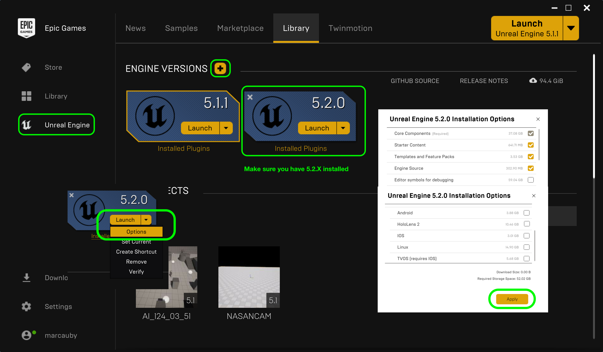

### Setting Up Unreal

[home](../README.md#user-content-ue5-bp-overview) • [next](../)

It is easiest to manage the various versions of Unreal using the **Epic Launcher**.  Thi allows you to install and run multiple versions of the engine.  Go to [Epic Launcher Download](https://store.epicgames.com/en-US/download) and install the Epic Game Launcher.  From here we will manage our game assets and resources. Intall Unreal 5.2 and use a PC.

 

---

##### `Step 1.`\|`BPOVR`|:small_blue_diamond:

You will need to have an account with Epic games, but don't worry they are free to register for.  Unreal Engine 4 is freely available for students.
Once you have installed the launcher run the program and select **Unreal Engine** on the side menu and **Library** on the top menu. Press the **+** button to add a new build (if needed) and select the latest version.  In my case it is `5.2.X`. Make sure it is of version `5.2.x` if you want to ensure that you are compatible with this walk through (the third digit should work as these represent non-breaking changes to the engine and just bug-fixes).

Also, before installing select **Options** and only download platforms you need support (PC is built in).  So I saved some space by removing hand held versions of the engine. We also do not need the **Editor symbols for debugging** yet so we can save ~60 gigs here by not including it.  You can add these at any time in the future.

##### `Step 2.`\|`BPOVR`|:small_blue_diamond: :small_blue_diamond: 

Now once it installs press the **Launch** button on the **5.2.X** version of Unreal.

##### `Step 3.`\|`BPOVR`|:small_blue_diamond: :small_blue_diamond: :small_blue_diamond:

Now once it installs press the **Launch** button on the latest version of Unreal.

##### `Step 4.`\|`BPOVR`|:small_blue_diamond: :small_blue_diamond: :small_blue_diamond: :small_blue_diamond:

This brings up the **Template** screen.  This allows you to select games with the key assets already implemented.  We will select a **Blank** project then press the **Next** button. We will start with a **C++** project.  Leave the quality at **Maximum Quality**, **Raytracing** disabled, a target platform of **Desktop / Console** and we have **No Starter Content**.  Outside of changing Blueprint to C++, all other settings should be default.  Then select a folder and call the project `MyFirstProject`. Press the **Create Project** button.

##### `Step 5.`\|`BPOVR`| :small_orange_diamond:

##### `Step 6.`\|`BPOVR`| :small_orange_diamond: :small_blue_diamond:

##### `Step 7.`\|`BPOVR`| :small_orange_diamond: :small_blue_diamond: :small_blue_diamond:

##### `Step 8.`\|`BPOVR`| :small_orange_diamond: :small_blue_diamond: :small_blue_diamond: :small_blue_diamond:

##### `Step 9.`\|`BPOVR`| :small_orange_diamond: :small_blue_diamond: :small_blue_diamond: :small_blue_diamond: :small_blue_diamond:

##### `Step 10.`\|`BPOVR`| :large_blue_diamond:

##### `Step 11.`\|`BPOVR`| :large_blue_diamond: :small_blue_diamond: 

##### `Step 12.`\|`BPOVR`| :large_blue_diamond: :small_blue_diamond: :small_blue_diamond: 

##### `Step 13.`\|`BPOVR`| :large_blue_diamond: :small_blue_diamond: :small_blue_diamond:  :small_blue_diamond: 

##### `Step 14.`\|`BPOVR`| :large_blue_diamond: :small_blue_diamond: :small_blue_diamond: :small_blue_diamond:  :small_blue_diamond: 

##### `Step 15.`\|`BPOVR`| :large_blue_diamond: :small_orange_diamond: 

##### `Step 16.`\|`BPOVR`| :large_blue_diamond: :small_orange_diamond:   :small_blue_diamond: 

##### `Step 17.`\|`BPOVR`| :large_blue_diamond: :small_orange_diamond: :small_blue_diamond: :small_blue_diamond:

##### `Step 18.`\|`BPOVR`| :large_blue_diamond: :small_orange_diamond: :small_blue_diamond: :small_blue_diamond: :small_blue_diamond:

##### `Step 19.`\|`BPOVR`| :large_blue_diamond: :small_orange_diamond: :small_blue_diamond: :small_blue_diamond: :small_blue_diamond: :small_blue_diamond:

##### `Step 20.`\|`BPOVR`| :large_blue_diamond: :large_blue_diamond:

##### `Step 21.`\|`BPOVR`| :large_blue_diamond: :large_blue_diamond: :small_blue_diamond:

<!--  -->

| [home](../README.md#user-content-ue5-bp-overview) | [next](../)|
|---|---|
